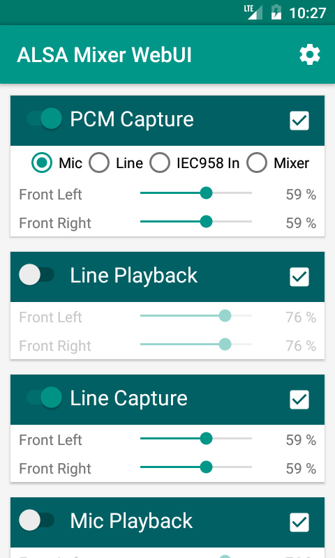

# ALSA Mixer WebUI for Android

Android client for control ALSA volume on remote server using [ALSA Mixer WebUI](https://github.com/JiriSko/amixer-webui/).

## Supported version

- Android 4.0.3 and newer

## Usage

- Install from [latest APK](https://github.com/JiriSko/amixer-webui-android/releases/download/v0.3.0/amixer-webui-v0.3.0.apk), or
- Build from source code

## License

The application is released under [The MIT License](LICENSE).
