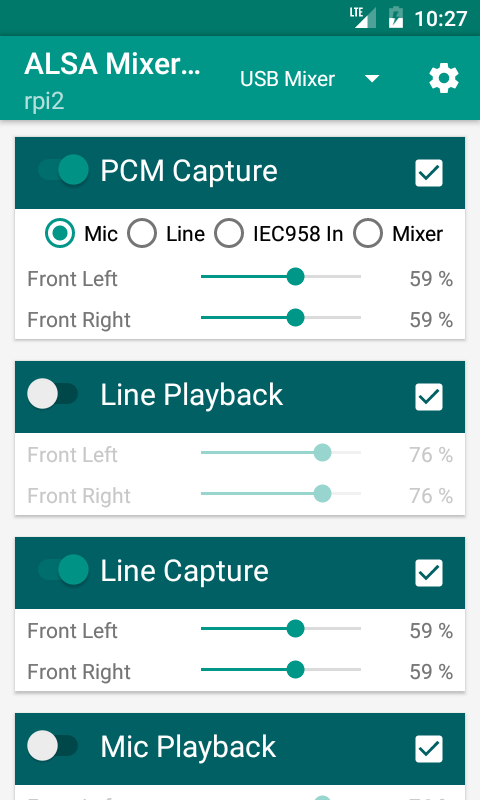

# ALSA Mixer WebUI for Android

 

Android client for control ALSA volume on remote server using [ALSA Mixer WebUI](https://github.com/JiriSko/amixer-webui/).

## Supported version

- Android 4.0.3 and newer

## Usage

- Install from [latest APK](https://github.com/JiriSko/amixer-webui-android/releases/download/v0.3.2/amixer-webui-v0.3.2.apk), or
- Get it on [F-Droid](https://f-droid.org/packages/cz.jiriskorpil.amixerwebui/)
- Build from source code

## License

The application is released under [The MIT License](LICENSE).
